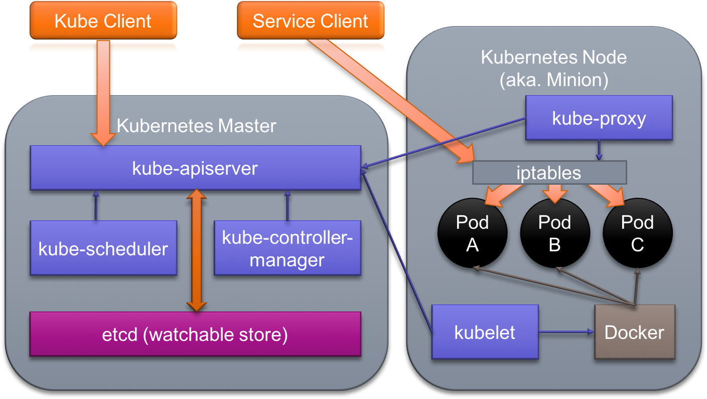

# Kubernetes


## Kubernetes Setup

Kubernetes is an open-source platform for automating deployment, scaling, and operations of application containers
across clusters of hosts. Kubernetes seeks to foster an ecosystem of components and tools that relieve the burden of
running applications in public and private clouds and can run on a range of platforms, from your laptop, to VMs on a
cloud provider, to racks of bare metal servers.

In this lab we will setup and explore a minimal Kubernetes cluster. Installation has several prerequisites:

- **Linux** – The Kubernetes Control Plane that we will set up only supports Linux at the time of writing. The
  Kubernetes binaries are available as standalone archives or through package managers for most major Linux
  distributions (RHEL/CentOS, Ubuntu, etc.). Worker nodes (ones that run regular workloads) can be Linux or Windows.
- **Container Runtime** – A Kubernetes cluster only requires the ability to pull images and run containers. Container
  runtimes like `containerd` or `CRI-O` are preferred over container engines like Docker or Podman (which include build
  and networking capabilities that Kubernetes does not require). The latest containerd versions are distributed through
  repositories hosted by Docker under the `containerd.io` package.
- **Kubeadm** - The reference installer that provides an easy interface for initializing, expanding, and upgrading a
  Kubernetes cluster. Kubeadm sets up the following for us:
  - **etcd** – Kubernetes requires a distributed key/value store to manage discovery and cluster metadata; though
    Kubernetes was originally designed to make this function pluggable, etcd is the only practical option.
  - **Kubernetes Control Plane** – Kubernetes is a microservice-based system and is composed of several services. The
    Kubelet handles container operations for a given node, the API server supports the main cluster API, etc.

This lab will walk you through a basic Kubernetes installation. The model below illustrates the Kubernetes control plane
and worker node roles, we will run both on a single system.




_NOTE: Kubernetes requires an Open Container Initiative compliant Container Runtime. If you previously installed Docker,
skip to section 1!_


### 0. Install Docker support

Login to your machine using an ssh client:

```
@laptop:~$ chmod 400 <class SSH Key>.pem

@laptop:~$ ssh -i <class SSH Key>.pem ubuntu@<your VM IP>

Welcome to Ubuntu 22.04.2 LTS (GNU/Linux 5.15.0-1031-aws x86_64)

...

~$
```

Docker provides a convenience script to install the latest version of Docker. While not recommended for production
environments, it works for quick installs in testing, dev and lab scenarios. Install `docker` on your lab system using the
get.docker.com install script.

> DO NOT follow the instructions provided by the script's output!

```
~$ wget -qO - https://get.docker.com/ | sh

# Executing docker install script, commit: 0221adedb4bcde0f3d18bddda023544fc56c29d1

...

~$
```

For our in-class purposes, eliminating the need for `sudo` execution of the `docker` command will simplify our practice
sessions--but setting up docker for rootless access (as the script suggests) would be overly complicated. The easiest
way to make it possible to connect to the local Docker daemon without `sudo` is to add our user id to the _docker_
group. To add your user to the _docker_ group execute the following command:

```
~$ sudo usermod -aG docker $(whoami)

~$
```

Even though the _docker_ group was added to your user's group list, your login shell maintains the old groups. After
updating your user groups you will need to restart your login shell to ensure the changes take effect.

In the lab system the easiest approach is to logout at the command line:

```
~$ exit

logout

@laptop:~$
```

Now, simply reconnect:

```
@laptop:~$ ssh -i <class SSH Key>.pem ubuntu@<your VM IP>

...

~$
```

After logging back in, check to see that your user shell session is now a part of the _docker_ group:

```
~$ id

uid=1000(ubuntu) gid=1000(ubuntu) groups=1000(ubuntu),4(adm),24(cdrom),27(sudo),30(dip),46(plugdev),116(lxd),125(libvirt),998(docker)

~$
```

Great. Your current shell user, and any new shell sessions, can now use the `docker` command without elevation.


### 1. Set up the host

First we need to address a few host-level Kubernetes installation prerequisites.


#### 1a. Swap (vs memory limits)

> N.B. On most cloud instances this step is not necessary as swap is typically disabled by default

As of K8s 1.8, the kubelet fails if swap is enabled on a node. You can override this requirement using the
`--fail-swap-on=false` flag on the Kubelet. However, we can simply turn off swap with `sudo swapoff -a`:

```
~$ sudo swapoff -a

~$ sudo cat /proc/swaps

Filename				Type		Size	Used	Priority

~$
```

Comment out any `swap` volume entry in the file system table file, fstab. If you do not comment out the swap volume the
swap will re-enable on reboot and the Kubelet will fail to start and the rest of your cluster will not start either.


#### 1b. Prepare containerd to use the container runtime interface and systemd

The `containerd.io` that comes with Docker installs a Docker-appropriate containerd configuration at
`/etc/containerd/config.toml`, which we will need to change:

```
~$ cat /etc/containerd/config.toml

#   Copyright 2018-2022 Docker Inc.

#   Licensed under the Apache License, Version 2.0 (the "License");
#   you may not use this file except in compliance with the License.
#   You may obtain a copy of the License at

#       http://www.apache.org/licenses/LICENSE-2.0

#   Unless required by applicable law or agreed to in writing, software
#   distributed under the License is distributed on an "AS IS" BASIS,
#   WITHOUT WARRANTIES OR CONDITIONS OF ANY KIND, either express or implied.
#   See the License for the specific language governing permissions and
#   limitations under the License.

disabled_plugins = ["cri"]

...

~$
```

The `disabled_plugins = ["cri"]` line prevents anything using the container runtime interface (like the Kubernetes
Kubelet or a tool like `crictl`) from interacting with this instance of containerd. We can opt out of this by
regenerating a configuration using `containerd config default`.

Back up the `/etc/containerd/config.toml`:

```
~$ sudo mv /etc/containerd/config.toml /etc/containerd/config.docker

~$
```

Then use `containerd config default` to populate the default containerd settings (which will effectively remove the
restriction):

```
~$ sudo containerd config default | sudo tee /etc/containerd/config.toml

disabled_plugins = []
imports = []
oom_score = 0
plugin_dir = ""

...

~$
```

Before proceeding, you need to also change the cgroup manager.

By default, the containerd uses `cgroupfs` to manage the Linux `cgroups` for container isolation.

Control groups, or cgroups, are used to constrain resources that are allocated to processes. Using _cgroupfs_ alongside
_systemd_ means that there will then be two different cgroup managers. A single cgroup manager simplifies the view of
what resources are being allocated and will by default have a more consistent view of the available and in-use
resources.

Modify containerd to use the systemd cgroup management driver:

```
~$ sudo sed -i -e 's/SystemdCgroup = false/SystemdCgroup = true/' /etc/containerd/config.toml

~$
```

This `sed` command modifies any strings in the configuration for `SystemdCgroup`.

We need to run another `sed` command to ensure containerd also uses the correct pause container image. Pause containers
are used by Kubernetes to help enable the "pod sandbox" - the shared isolation used to enable more complex container
patterns when running containers within Kubernetes.

```
~$ sudo sed -i -e 's/pause:3.6/pause:3.9/' /etc/containerd/config.toml

~$
```

After changing the configuration, restart the `containerd` service:

```
~$ sudo systemctl restart containerd

~$
```

Moving forward, containerd is now open to CRI requests and uses systemd to manage all container cgroups.


### 2. Install Kubernetes package support

With the host prepared, it is time to install the Kubernetes binaries. These are available on most package managers,
including the Debian `apt` and RHEL-based `yum`.

Add the Google cloud packages repo key so that we can install packages hosted by Google:

```
~$ curl -fsSL https://pkgs.k8s.io/core:/stable:/v1.29/deb/Release.key | \
sudo gpg --dearmor -o /etc/apt/keyrings/kubernetes-apt-keyring.gpg

~$
```

Now add a repository list file with an entry for Ubuntu Xenial `apt.kubernetes.io` packages. The following command
copies the repo url into the "kubernetes.list" file:

```
~$ echo 'deb [signed-by=/etc/apt/keyrings/kubernetes-apt-keyring.gpg] https://pkgs.k8s.io/core:/stable:/v1.29/deb/ /' | \
sudo tee /etc/apt/sources.list.d/kubernetes.list

deb [signed-by=/etc/apt/keyrings/kubernetes-apt-keyring.gpg] https://pkgs.k8s.io/core:/stable:/v1.29/deb/ /

~$
```

Update the package indexes to add the Kubernetes packages from the Kubernetes apt repository:

```
~$ sudo apt update

...

Get:6 https://prod-cdn.packages.k8s.io/repositories/isv:/kubernetes:/core:/stable:/v1.29/deb  InRelease [1186 B]
Get:7 https://prod-cdn.packages.k8s.io/repositories/isv:/kubernetes:/core:/stable:/v1.29/deb  Packages [2759 B]
Fetched 114 kB in 1s (106 kB/s)
Reading package lists... Done
Building dependency tree... Done
Reading state information... Done
36 packages can be upgraded. Run 'apt list --upgradable' to see them.

~$
```

Notice the new `prod-cdn.packages.k8s.io` repository above. If you _do not see it in your terminal output_, you must fix
the entry in `/etc/apt/sources.list.d/kubernetes.list` before moving on!

Now we can install standard Kubernetes packages.


### 3. Install kubeadm and other prereq packages

The `kubeadm` tool simplifies the process of installing a Kubernetes cluster. To use `kubeadm` we will also need the
`kubectl` cluster CLI tool and the `kubelet` node manager. We will also install Kubernetes CNI (Container Network
Interface) support for multi-host networking.

Use the `apt` package manager to install the needed packages for the latest cluster version of Kubernetes:

```
~$ sudo apt install -y kubeadm

Reading package lists... Done
Building dependency tree
Reading state information... Done
The following additional packages will be installed:
  conntrack cri-tools ebtables kubectl kubelet kubernetes-cni socat
Suggested packages:
  nftables
The following NEW packages will be installed:
  conntrack cri-tools ebtables kubeadm kubectl kubelet kubernetes-cni socat
0 upgraded, 8 newly installed, 0 to remove and 17 not upgraded.
Need to get 83.7 MB of archives.
After this operation, 340 MB of additional disk space will be used.

...

~$
```

Kubeadm and Kubelet are now installed and ready to initialize a cluster:


### 4. Install and start the Kubernetes control plane components

Verify kubeadm is properly installed by checking kubeadm's version:

```
~$ kubeadm version

kubeadm version: &version.Info{Major:"1", Minor:"29", GitVersion:"v1.29.0", GitCommit:"3f7a50f38688eb332e2a1b013678c6435d539ae6", GitTreeState:"clean", BuildDate:"2023-12-13T08:50:10Z", GoVersion:"go1.21.5", Compiler:"gc", Platform:"linux/amd64"}

~$
```

With all of the necessary prerequisites installed we can now use `kubeadm` with the
`--cri-socket=unix:///run/containerd/containerd.sock` argument to initialize a cluster with containerd as the container
runtime:

_DO NOT execute any of the additional instructions output after running `sudo kubeadm init`!_

```
~$ sudo kubeadm init --cri-socket=unix:///run/containerd/containerd.sock

[init] Using Kubernetes version: v1.29.0
[preflight] Running pre-flight checks
[preflight] Pulling images required for setting up a Kubernetes cluster
[preflight] This might take a minute or two, depending on the speed of your internet connection
[preflight] You can also perform this action in beforehand using 'kubeadm config images pull'
[certs] Using certificateDir folder "/etc/kubernetes/pki"
[certs] Generating "ca" certificate and key
[certs] Generating "apiserver" certificate and key
[certs] apiserver serving cert is signed for DNS names [ip-172-31-17-249 kubernetes kubernetes.default kubernetes.default.svc kubernetes.default.svc.cluster.local] and IPs [10.96.0.1 172.31.17.249]
[certs] Generating "apiserver-kubelet-client" certificate and key
[certs] Generating "front-proxy-ca" certificate and key
[certs] Generating "front-proxy-client" certificate and key
[certs] Generating "etcd/ca" certificate and key
[certs] Generating "etcd/server" certificate and key
[certs] etcd/server serving cert is signed for DNS names [ip-172-31-17-249 localhost] and IPs [172.31.17.249 127.0.0.1 ::1]
[certs] Generating "etcd/peer" certificate and key
[certs] etcd/peer serving cert is signed for DNS names [ip-172-31-17-249 localhost] and IPs [172.31.17.249 127.0.0.1 ::1]
[certs] Generating "etcd/healthcheck-client" certificate and key
[certs] Generating "apiserver-etcd-client" certificate and key
[certs] Generating "sa" key and public key
[kubeconfig] Using kubeconfig folder "/etc/kubernetes"
[kubeconfig] Writing "admin.conf" kubeconfig file
[kubeconfig] Writing "super-admin.conf" kubeconfig file
[kubeconfig] Writing "kubelet.conf" kubeconfig file
[kubeconfig] Writing "controller-manager.conf" kubeconfig file
[kubeconfig] Writing "scheduler.conf" kubeconfig file
[etcd] Creating static Pod manifest for local etcd in "/etc/kubernetes/manifests"
[control-plane] Using manifest folder "/etc/kubernetes/manifests"
[control-plane] Creating static Pod manifest for "kube-apiserver"
[control-plane] Creating static Pod manifest for "kube-controller-manager"
[control-plane] Creating static Pod manifest for "kube-scheduler"
[kubelet-start] Writing kubelet environment file with flags to file "/var/lib/kubelet/kubeadm-flags.env"
[kubelet-start] Writing kubelet configuration to file "/var/lib/kubelet/config.yaml"
[kubelet-start] Starting the kubelet
[wait-control-plane] Waiting for the kubelet to boot up the control plane as static Pods from directory "/etc/kubernetes/manifests". This can take up to 4m0s
[apiclient] All control plane components are healthy after 9.002925 seconds
[upload-config] Storing the configuration used in ConfigMap "kubeadm-config" in the "kube-system" Namespace
[kubelet] Creating a ConfigMap "kubelet-config" in namespace kube-system with the configuration for the kubelets in the cluster
[upload-certs] Skipping phase. Please see --upload-certs
[mark-control-plane] Marking the node ip-172-31-17-249 as control-plane by adding the labels: [node-role.kubernetes.io/control-plane node.kubernetes.io/exclude-from-external-load-balancers]
[mark-control-plane] Marking the node ip-172-31-17-249 as control-plane by adding the taints [node-role.kubernetes.io/control-plane:NoSchedule]
[bootstrap-token] Using token: 5mxwrv.sgicxs0q5efdd4mo
[bootstrap-token] Configuring bootstrap tokens, cluster-info ConfigMap, RBAC Roles
[bootstrap-token] Configured RBAC rules to allow Node Bootstrap tokens to get nodes
[bootstrap-token] Configured RBAC rules to allow Node Bootstrap tokens to post CSRs in order for nodes to get long term certificate credentials
[bootstrap-token] Configured RBAC rules to allow the csrapprover controller automatically approve CSRs from a Node Bootstrap Token
[bootstrap-token] Configured RBAC rules to allow certificate rotation for all node client certificates in the cluster
[bootstrap-token] Creating the "cluster-info" ConfigMap in the "kube-public" namespace
[kubelet-finalize] Updating "/etc/kubernetes/kubelet.conf" to point to a rotatable kubelet client certificate and key
[addons] Applied essential addon: CoreDNS
[addons] Applied essential addon: kube-proxy

Your Kubernetes control-plane has initialized successfully!

To start using your cluster, you need to run the following as a regular user:

  mkdir -p $HOME/.kube
  sudo cp -i /etc/kubernetes/admin.conf $HOME/.kube/config
  sudo chown $(id -u):$(id -g) $HOME/.kube/config

Alternatively, if you are the root user, you can run:

  export KUBECONFIG=/etc/kubernetes/admin.conf

You should now deploy a pod network to the cluster.
Run "kubectl apply -f [podnetwork].yaml" with one of the options listed at:
  https://kubernetes.io/docs/concepts/cluster-administration/addons/

Then you can join any number of worker nodes by running the following on each as root:

kubeadm join 172.31.17.249:6443 --token 5mxwrv.sgicxs0q5efdd4mo \
	--discovery-token-ca-cert-hash sha256:8a5696ac6b7ae9d2828857b362f57bfc4d25bfcf4d46fa61be7d1e45c8a6741c

~$
```

Examine the output from kubeadm but _DO NOT follow the suggestions!!_ We will be performing them during the subsequent
steps of this lab in guided exercises!


### 5. Configure kubectl

The command line tool used to interact with our Kubernetes cluster is `kubectl`. `kubectl` makes interacting with the
cluster from the command line easy by packaging (or generating) Kubernetes specifications from your inputs and
submitting them to the Kubernetes API Server on your behalf.

Run the `kubectl config view` subcommand to display the current client configuration:

```
~$ kubectl config view
```
```yaml
apiVersion: v1
clusters: null
contexts: null
current-context: ""
kind: Config
preferences: {}
users: null
```
```
~$
```

As you can see the only value we have configured is the `apiVersion` which is set to `v1`, the current Kubernetes API
version. The `kubectl` command tries to reach the API server on port 8080 via the localhost loopback without TLS by
default (which will not work).

This config is stored in a Kubeconfig file. Kubeconfig files provide credentials for sending API requests to a
Kubernetes API server. They define API server addresses to send requests to and user authentication information which
identifies the client (in this case, `kubectl`).

Kubeadm creates a kubeconfig file during deployment of the control plane and places it in `/etc/kubernetes` as
`admin.conf`. Copy `admin.conf` in a new `.kube` directory under your home directory, and change its owner (`chown`) to
your UID/GID:

```
~$ mkdir -p $HOME/.kube

~$ sudo cp -i /etc/kubernetes/admin.conf $HOME/.kube/config

~$ sudo chown $(id -u):$(id -g) $HOME/.kube/config

~$
```

Verify the kubeconfig we just copied is understood:

```
~$ kubectl config view
```
```yaml
apiVersion: v1
clusters:
- cluster:
    certificate-authority-data: DATA+OMITTED
    server: https://172.31.17.249:6443
  name: kubernetes
contexts:
- context:
    cluster: kubernetes
    user: kubernetes-admin
  name: kubernetes-admin@kubernetes
current-context: kubernetes-admin@kubernetes
kind: Config
preferences: {}
users:
- name: kubernetes-admin
  user:
    client-certificate-data: DATA+OMITTED
    client-key-data: DATA+OMITTED
```
```
~$
```

The combination of an API server address and user is called a context. The default context in this kubeconfig file is
`kubernetes-admin@kubernetes`, which is the administrator for the cluster you just initialized:

```
~$ kubectl config current-context

kubernetes-admin@kubernetes

~$
```

The `kubernetes-admin` user grants you full control over this cluster. You can now use `kubectl` to gather information
about the resources deployed with your Kubernetes cluster, verify that the current context can access the cluster:

```
~$ kubectl get node

NAME               STATUS     ROLES           AGE    VERSION
ip-172-31-17-249   NotReady   control-plane   7m3s   v1.29.0

~$
```

`kubectl` can successfully communicate with the API server but it looks like the cluster is not ready for operation just
yet (note the "`NotReady`" value under `STATUS`). The `ROLES` entries indicate that this node hosts the core Kubernetes
control plane services like the API Server, Scheduler, and Controller Manager.


### 6. Taints

During the default initialization of the cluster, kubeadm applies a series of reservations to the control plane node
which ensures that only control plane components (like the API Server, Scheduler, and Controller Manager) run on that
node. This ensures stability and guarantee resources for them during normal operation. Kubernetes is typically expected
to run across multiple nodes, with regular user workloads running on other nodes (commonly known was "workers"). For a
single-node development/learning test case, these reservations need to be removed.

In Kubernetes terms, the control plane node is "tainted". A taint consists of a _key_, an _optional value_, and an
_effect_. The effect must be _NoSchedule_, _PreferNoSchedule_ or _NoExecute_.

Above we used `kubectl get node` to output the table showing us information about our node but by using the `-o`
outputter with the `name` argument we can just receive the node's name, try it:

```
~$ kubectl get node -o name

node/ip-172-31-32-172

~$
```

We can nest the above command in a sub-shell and pass it to the `kubectl describe` subcommand to see details for the
control plane node, using `grep` to search for the term `taint`

```
~$ kubectl describe $(kubectl get node -o name) | grep -i taint -A2

Taints:             node-role.kubernetes.io/control-plane:NoSchedule
                    node.kubernetes.io/not-ready:NoSchedule
Unschedulable:      false

~$
```

We will examine the full `describe` output later but as you can see the master has the
`node-role.kubernetes.io/control-plane` taint with the effect `NoSchedule`. This means the Kubernetes scheduler can not
place pods on this node. To remove this taint we can use the `kubectl taint` subcommand.

_NOTE:_ the command below removes ("`-`") the taints from all (`--all`) nodes in the cluster. _Do not forget the
trailing "`-`" following the taint key "master"! The "`-`" is what tells Kubernetes to remove the taint!_


```
~$ kubectl taint node --all node-role.kubernetes.io/control-plane-

node/ip-172-31-32-172 untainted

~$
```

> We know what you're thinking and we agree, "taint" is an awful name for this feature and a trailing dash with no space
is an equally wacky way to remove something.

Check again to see if the taint was removed:

```
~$ kubectl describe $(kubectl get node -o name) | grep -i taints -A2

Taints:             node.kubernetes.io/not-ready:NoSchedule
Unschedulable:      false
Lease:

~$
```

After removing the control plane taints, one more taint (the "`not-ready`" taint) remains. This indicates that the node
(or rather, its Kubelet) is not ready to run workloads.

Since the taint mentions status `not-ready`, let's grep "`ready`" status from the node's `describe` output:

```
~$ kubectl describe $(kubectl get node -o name) | grep -i ready

Taints:             node.kubernetes.io/not-ready:NoSchedule
  Ready            False   Mon, 25 Sep 2023 08:27:44 +0000   Mon, 25 Sep 2023 08:27:27 +0000   KubeletNotReady              container runtime network not ready: NetworkReady=false reason:NetworkPluginNotReady message:Network plugin returns error: cni plugin not initialized

~$
```

Our Kubernetes cluster does not have any networking in place. Let's fix that!


### 7. Enable networking

In the previous step, we found out that our control plane node is hung in the `not ready` status, with the Kubelet
reporting that the container network plugin is not ready.

Based on the readiness message from the node, the node expects a CNI plugin for networking but we have not yet supplied
a CNI plugin. We can easily add the Weave CNI container networking drivers using a POD spec from the Internet:

```
~$ kubectl apply -f https://github.com/weaveworks/weave/releases/download/v2.8.1/weave-daemonset-k8s-1.11.yaml

serviceaccount/weave-net created
clusterrole.rbac.authorization.k8s.io/weave-net created
clusterrolebinding.rbac.authorization.k8s.io/weave-net created
role.rbac.authorization.k8s.io/weave-net created
rolebinding.rbac.authorization.k8s.io/weave-net created
daemonset.apps/weave-net created

~$
```

CNI plugins assign IP addresses to workloads in the cluster. Different CNI plugins will achieve this in different ways.
The weave-net plugin you installed creates a virtual router process and bridge interface on every host. Pods are
attached to the bridge interface with a plugin-managed IP address. The virtual routers (running as containers managed by
a daemonset) communicate with each other to realize the pod network, establishing a protocol handshake and learning
about the pod network topology.

The CNI plugin components will now take a few moments (in this test cluster) to start up. Check if there are any more
taints on our master node and see if it is finally ready:

```
~$ kubectl describe $(kubectl get node -o name) | grep -i taints

Taints:             <none>

~$ kubectl get node

NAME               STATUS   ROLES           AGE    VERSION
ip-172-31-17-249   Ready    control-plane   6m     v1.29.0

~$
```

The taint has been cleared from our control plane node, and Kubernetes will now allow pods to run on our single node
cluster.


### 8. Kubernetes applications

Kubernetes clusters track and manage objects of various "kinds". Applications make use of four kinds of objects in
particular:

-	**Pods** – groups of containers deployed as a unit
-	**ReplicaSets** – sets of pods defined by a template which the Controller Manager replicates across the cluster
-	**Deployments** – a rollout strategy for pods and replica sets
-	**Services** – endpoints used to distribute requests to one of a pod’s replicas

Thus basic Kubernetes applications consist of pods, which implement the application functionality; ReplicaSets, which
ensure pods are always available; and Services which expose a dynamic set of pods to clients as a single endpoint.
Deployments describe how to launch or upgrade a given application (set of pods) at a controlled rate.

Using `kubectl` you can create Deployments and Services, monitor cluster components and pods, upgrade Deployments and
remove resources that are no longer required.

The `kubectl` command provides a `get` subcommand which can be used to get information on any one of the key Kubernetes
component types: Deployments, Pods, ReplicaSets, and Services. While you can type `kubectl get replicasets`, that would
be fairly inhumane so `kubectl` allows you to use abbreviations like `rs` for ReplicaSets, `deploy` for Deployments, and
even `po` for Pods!

If you want to save yourself even more typing you can take advantage of kubectl's tab completion functionality:

```
~$ source <(kubectl completion bash)

~$
```

Now try kubectl get <tab> <TAB> again. You will receive suggestions from `kubectl`:

```
~$ kubectl get # <Press tab twice and do not press enter>

apiservices.apiregistration.k8s.io                            mutatingwebhookconfigurations.admissionregistration.k8s.io
certificatesigningrequests.certificates.k8s.io                namespaces

...

^C

~$
```

Make sure to `Ctrl C` to cancel the command.

That is much better! You can now type "kubectl get ser<TAB>" and it will autocomplete to "kubectl get service". You can
make this persist in all of your shell sessions by running: `echo "source <(kubectl completion bash)" >> ~/.bashrc`

List the currently running services, deployments, replica sets, and pods on your cluster:

```
~$ kubectl get service,deployments,replicasets,pods

NAME                 TYPE        CLUSTER-IP   EXTERNAL-IP   PORT(S)   AGE
service/kubernetes   ClusterIP   10.96.0.1    <none>        443/TCP   2m20s

~$
```

The only service running in our cluster is the _kubernetes_ service itself. There are no Deployments, ReplicaSets, or
Pods yet.

There are other workloads running on the cluster in other namespaces, which are logical divisions of the
cluster where resources exist. Namespaces can separate API resources in a cluster on a per-user, per-application,
per-function, or any other user-defined scheme.

Do the same for the resources under the `kube-system` namespace:

```
~$ kubectl get service,deployments,replicaset,pods --namespace=kube-system

NAME               TYPE        CLUSTER-IP   EXTERNAL-IP   PORT(S)                  AGE
service/kube-dns   ClusterIP   10.96.0.10   <none>        53/UDP,53/TCP,9153/TCP   2m28s

NAME                      READY   UP-TO-DATE   AVAILABLE   AGE
deployment.apps/coredns   2/2     2            2           2m28s

NAME                                 DESIRED   CURRENT   READY   AGE
replicaset.apps/coredns-5dd5756b68   2         2         2       2m23s

NAME                                           READY   STATUS    RESTARTS      AGE
pod/coredns-5dd5756b68-dkcl8                   1/1     Running   0             2m22s
pod/coredns-5dd5756b68-x5qpj                   1/1     Running   0             2m22s
pod/etcd-ip-172-31-32-172                      1/1     Running   0             2m28s
pod/kube-apiserver-ip-172-31-32-172            1/1     Running   0             2m29s
pod/kube-controller-manager-ip-172-31-32-172   1/1     Running   0             2m28s
pod/kube-proxy-rzlfz                           1/1     Running   0             2m22s
pod/kube-scheduler-ip-172-31-32-172            1/1     Running   0             2m28s
pod/weave-net-28cfx                            2/2     Running   1 (41s ago)   47s

~$
```

As you can see, the `kube-system` namespace is a place for Kubernetes system pods like DNS, etcd, etc. Don't mess with
these -- they are required for your cluster to function!

We can also view all namespaces with the `--all-namespaces` or `-A` flags if we have permission.

You now have a clean, best-practices driven Kubernetes cluster to experiment with.


### 9. Run a container

Now that we have a cluster (of one) running we can run some containers. Users do not directly deploy containers on
Kubernetes. Instead, containers are defined in a resource called a pod. Pods are specifications which define a
collection of one or more containers and their settings. The pod specifications are parsed by their assigned Kubelet,
which forwards instructions on how to create the containers to their local container runtime.

With the right permissions we can create a Pod on the fly using kubectl's `run` subcommand. Try it:

```
~$ kubectl run web --image docker.io/nginx:latest

pod/web created

~$
```

The `run` command generates a simple pod specification based on your inputs and submits it to the API server. In this
case, the pod was named `web` and is based on the image `docker.io/nginx:latest`.

> N.B. If you do not specify a tag for an image, most container runtimes default to the `latest` tag. Also, if you
> exclude a registry address (i.e. `docker.io/`) from the image, most container runtimes usually pull from DockerHub.

Now examine your pod:

```
~$ kubectl get pod

NAME   READY   STATUS    RESTARTS   AGE
web    1/1     Running   0          3s

~$
```

If your pod is not yet running, the container runtime on the node is likely pulling the image (`STATUS.ContainerCreating`)
for `nginx` down from DockerHub. Keep checking on your pod until it is running.

We can verify that our `web` pod is up and running with curl but we need to get the pod's ip address. You can discover
the ip address by displaying pod data with the wide output:

```
~$ kubectl get pod -o wide

NAME   READY   STATUS    RESTARTS   AGE   IP          NODE               NOMINATED NODE   READINESS GATES
web    1/1     Running   0          79s   10.32.0.4   ip-172-31-32-172   <none>           <none>

~$
```

This IP address was assigned to the pod by the CNI plugin.

Now try to curl your pod using its IP address:

```
~$ curl 10.32.0.4

<!DOCTYPE html>
<html>
<head>
<title>Welcome to nginx!</title>

...

~$
```

This works because the Weave SDN we are using to manage Pod networking creates a route on the host to the `weave`
network interface (a software-based device connected to the weave pod network).

List the routes on your host:

```
~$ ip route

default via 172.31.32.1 dev ens5 proto dhcp src 172.31.32.172 metric 100
10.32.0.0/12 dev weave proto kernel scope link src 10.32.0.1
172.17.0.0/16 dev docker0 proto kernel scope link src 172.17.0.1 linkdown
172.31.0.2 via 172.31.32.1 dev ens5 proto dhcp src 172.31.32.172 metric 100
172.31.32.0/20 dev ens5 proto kernel scope link src 172.31.32.172 metric 100
172.31.32.1 dev ens5 proto dhcp scope link src 172.31.32.172 metric 100

~$
```

As you can see, all traffic destined for `10.32.0.0/12` is delivered to the `weave` device. Not all SDNs support traffic
from the host into the Pod network by default.

In most real-world cases a pod IP will not be directly accessible from a local client. You would need to run a client
pod in the cluster to test the service pod to contact the server from inside the cluster network or use other Kubernetes
features (like services and other integrations) to access the a pod from outside the cluster.

Try creating another pod named `client` and submitting a request to the web pod's IP from there. Kubernetes does allow
interactive sessions with containers in pods, giving you an easy way of interacting with containers from within the
cluster network:

```
~$ kubectl run client --image docker.io/busybox:latest -it

If you don't see a command prompt, try pressing enter.

/ # wget -qO - 10.32.0.4

<!DOCTYPE html>
<html>
<head>
<title>Welcome to nginx!</title>

...

/ # exit

Session ended, resume using 'kubectl attach client -c client -i -t' command when the pod is running

~$
```

List your pods again:

```
~$ kubectl get pod

NAME     READY   STATUS      RESTARTS   AGE
client   0/1     Completed   0          25s
web      1/1     Running     0          52s

~$
```

Our client pod is still running and, per the comment from `kubectl` on exit, we can reattach and resume the session to
it when desired.


### 10. CHALLENGE: kubectl run

- Run a pod named "`challenge`" based on the image `docker.io/rxmllc/hostinfo:latest`
  - The hostinfo image reports its hostname and IP address when queried
- Resume your interactive session with the "`client`" pod
- Query the "`challenge`" pod on port `9898` with wget
  - What does the response tell you about pod hostnames?
- Delete the `challenge` pod after completing the above steps


### 11. Clean up

Delete all pods you created in the above steps with `kubectl delete`:

```
~$ kubectl delete pod client web

pod "client" deleted
pod "web" deleted

~$
```

<br>

Congratulations, you have completed the lab!

<br>

_Copyright (c) 2023-2024 RX-M LLC, Cloud Native & AI Training and Consulting, all rights reserved_
